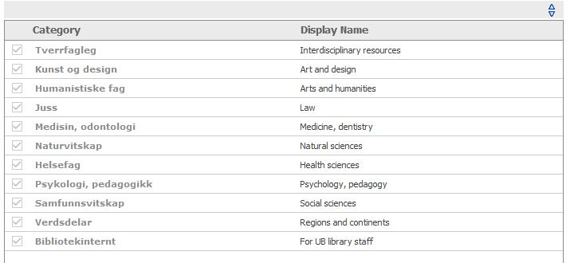
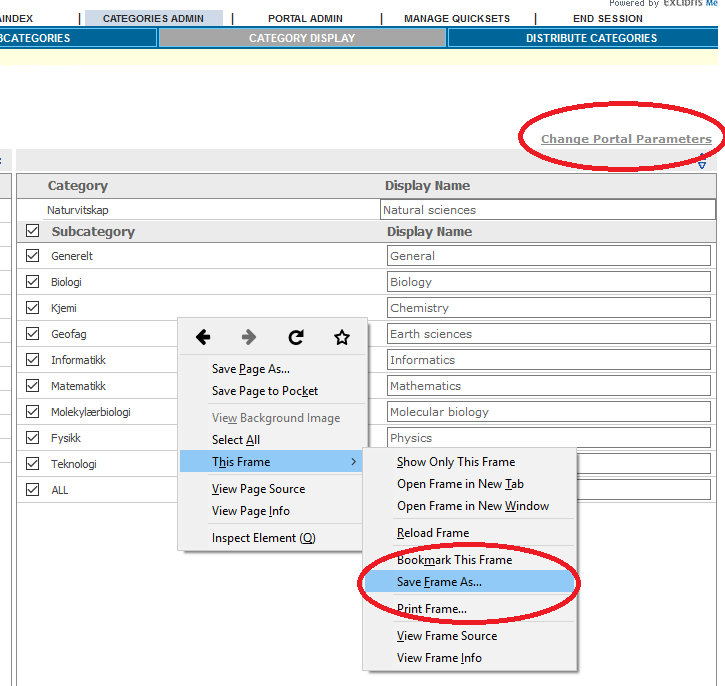

# Metalib2Marc (Alma)

Tools to convert an existing metalib database dump to [marcxml](http://www.loc.gov/standards/marcxml/). The output is generated for the 
[AZ databases](https://github.com/justinkelly/az_databases) used by
[Bibsys](https://bibsys.no) to genarate AÅ lists for its member libraries.

The scripts are mostly [xslt 2](https://www.w3.org/TR/xslt20/) scripts, which for convenience are wrapped in 
[ant](http://ant.apache.org/) targets. It contains:

- Retrieving categories and translations from metalib. 
- Analyzing unique xpaths in metalib dump to help mapping.
- Transformation from metalib to marcxml.
- Xspec unit tests, testing input > output of the xslt.
- TODO: Creating an alma portfolio import file for paid subscriptions.

## Prerequisites
### 1. Preprocessing the metalib dump
THe xml dump exported from our Metalib instance, has issues with illegal UTF-8 characters, which we solved by replacing the invalid characters.
There also seems to be issues with illegal xml, after saving. 
To make the xml valid, a search and replace for `([^<])(/line>)` `\1<\2` worked.
    
The required input for the project is a valid metalib dump xml file.

### 2. Downloading category html
The project requires html files downloaded for each category and language.
The html files are downloaded manually, once for each language and each main category. 

Go to the metalib admin page, and select `categories admin -> categories display`



For each existing category in each language we save frame as, and download to a single folder for our institution (`html/ubb`)
Use format `filename_nb.html` like in our example [folder](/language/html/ubb).



After all main category pages for all languages are downloaded, run the build.
Your output will look like 
[/categories.example.xml](/categories.example.xml) with your institutions metalib categories and languages.

If a category is used in a metalib record, and is missing from categories.xml the transformation will fail.

### Configuring the build
To run the tools create a `local.properties` from 
[/local.properties.template](/local.properties.template) (or run the build once to copy the template).

Replace with correct properties your local instance.

```
xsl.getCategoriesFromHtml.path=language/html/ubb
metalib.xml=examples.xml
xsl.metalib2marc.institution=UBB
xsl.metalib2marc.language="en nb"
```

Language property is space separated to control which languages are to be used. Since *the mapping does not allow both nb or nn*, one of them should be used.

## The mapping
We only export records where the records are defined as `ACTIVE` in Metalib. 
The mapping is done based on the output of analyze metalib stylesheet.
See [metalib_structure.xml](/metalib_structure.xml) or generate your own list.

```bash
# generate existing elements and attributes in your metalib dump
ant analyzeMetalib
```

The mapping is a work in progress. 

- We try to reuse as much as possible of the marc fields used.
- Some marc fields are excluded since they are not in the catalogue rules for Bibsys. These are added as issues, to decide if they should be removed, or moved to new marc fields.
- Almost all metalib only fields are stripped.
    - This includes all siblings of record elements, which are not categories, and all control fields which are non numerical (except `STA`, which is used for selecting only `ACTIVE` records).

## Running the build
```bash
# dependencies (osx)
brew install ant

git clone https://github.com/ubbdst/metalib2marc.git
cd metalib2marc

# Add xml file from metalib and configure metalib.xml in local.properties (see "1. Preprocessing the metalib dump")

# Download html for all categories (see 2. Downloading category html)
ant
```